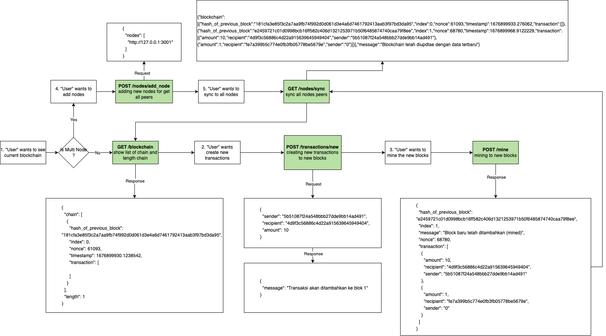

# blockchain-tutorial

## Blockchain Developer
https://roadmap.sh/blockchain

## Flow Diagram


## Table of Contents
- [blockchain-tutorial](#blockchain-tutorial)
  - [Blockchain Developer](#blockchain-developer)
  - [Flow Diagram](#flow-diagram)
  - [Table of Contents](#table-of-contents)
  - [Intallation](#intallation)
  - [Run application](#run-application)
  - [API Documentation](#api-documentation)
    - [I. /blockchain](#i-blockchain)
    - [II. /mine](#ii-mine)
    - [III. /transactions/new](#iii-transactionsnew)
    - [IV. /nodes/add\_node](#iv-nodesadd_node)
    - [V. /nodes/sync](#v-nodessync)
  - [Nodes](#nodes)
  - [Sources](#sources)

## Intallation
```
sudo pip3 install flask
sudo pip3 install requests

or 

python3 -m pip install flask
python3 -m pip install requests
```

## Run application
```
python3 blockchains/blockchain.py 3000
```

## API Documentation

### I. /blockchain
Get list of blockchain
```
curl --location 'http://localhost:3000/blockchain'
```

### II. /mine
Generate new mine block
```
curl --location 'http://localhost:3000/mine'
```

### III. /transactions/new
Adding new transaction to the block
```
curl --location 'http://localhost:3000/transactions/new' \
--header 'Content-Type: application/json' \
--data '{
    "sender": "5b51087f24a548bbb27dde9bb14ad491",
    "recepient": "4d9f3c56886c4d22a915639645949404",
    "amount": 10
}'
```

### IV. /nodes/add_node
```
curl --location 'http://localhost:3001/nodes/add_nodes' \
--header 'Content-Type: application/json' \
--data '{
    "nodes" : [
        "http://127.0.0.1:3000"
    ]
}'
```

### V. /nodes/sync
```
curl --location 'http://localhost:3001/nodes/sync'
```

## Nodes

Node 1: http://localhost:3000
```
python3 blockchains/blockchain.py 3000
```

Node 2: http://localhost:3001
```
python3 blockchains/blockchain.py 3001
```

## Sources

[](https://www.youtube.com/watch?v=s-OhwH1gs9w&list=PLH1gH0TmFBBhvZi4kEqU6kCjyv_y8qBae)